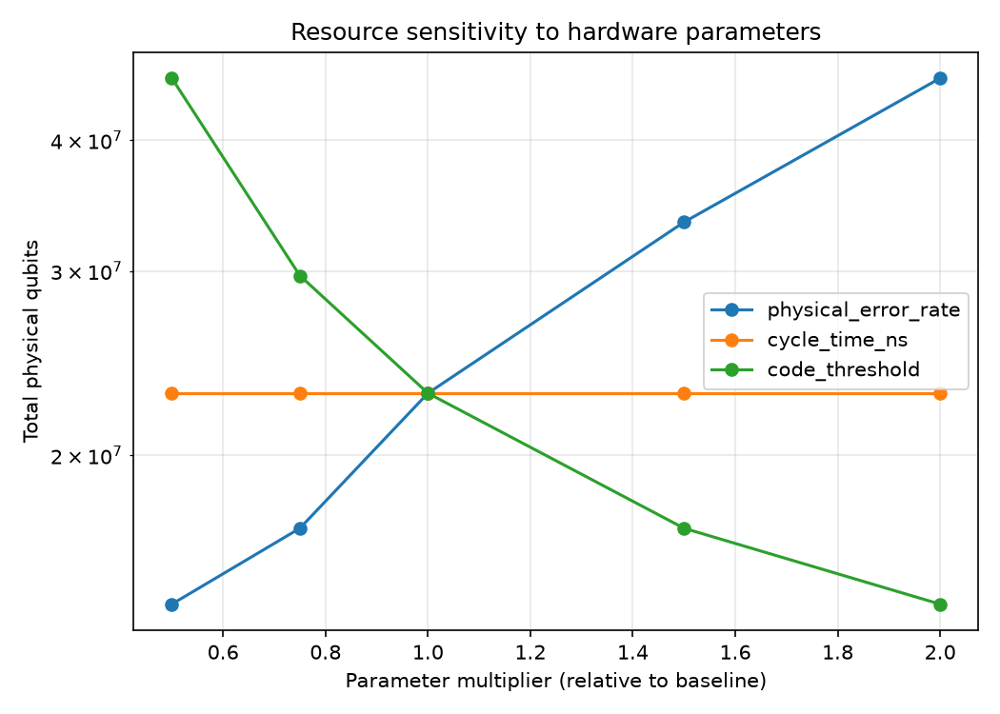
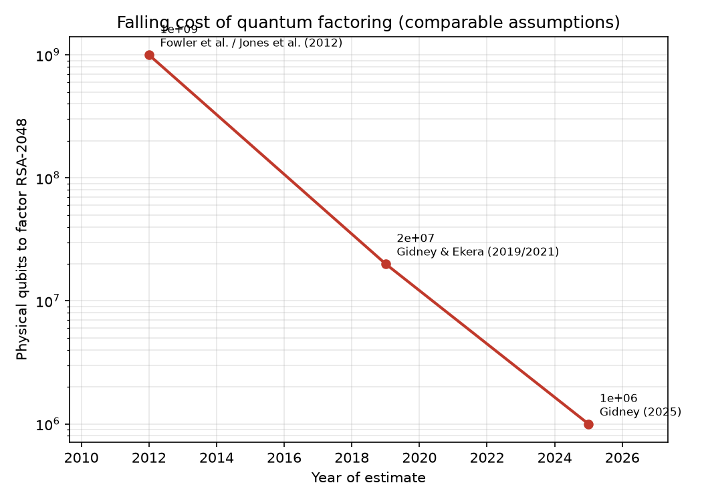

# Fault-Tolerance Economics

A **reproduction and sensitivity analysis** of the Gidney & Ekera (2021) resource
estimate for fault-tolerant quantum computing. Given a hardware profile (physical error rate,
surface-code cycle time, threshold) and an algorithm's logical requirements, it re-derives the
**physical qubits**, **runtime** and **cost** needed to run the computation under realistic
error-correction overhead, and then sweeps each assumption to show what drives the answer.

The application answers a concrete question:

> **How many physical qubits are needed to run Shor's algorithm on RSA-2048 under realistic error
> assumptions?**

This is **not new physics**: it is an auditable re-derivation of a published estimate with the
modeling assumptions made explicit, plus a sensitivity analysis of the published estimate. This is
repo 5 of a ten-part
[QEC research portfolio](https://github.com/afogelis/qec-portfolio).

## Scope

- **Quantitative modeling and forecasting:** propagating physical assumptions through the surface-code suppression law to a physical-qubit and runtime budget.
- **Sensitivity / scenario analysis:** identifying which hardware parameter (the physical error rate) dominates the cost, and by how much.
- **Strategy translation:** turning a physics result into a resource estimate with explicit assumptions and citations.

## Result

Calibrated to reproduce Gidney & Ekera (2021), the baseline superconducting profile
(p = 1e-3, 1 us cycle, 1% threshold) yields roughly **20 million physical qubits** at code distance
**d ~ 27-29**, running for about **8 hours**. See
[`reports/shor-rsa2048-resource-estimate.md`](reports/shor-rsa2048-resource-estimate.md) for the
full report, profile comparison and sensitivity tables.



*Sensitivity of the physical-qubit budget to each modeling assumption. The physical error rate dominates because it enters the required code distance exponentially.*

## The 2012 → 2019 → 2025 frontier

Beyond a single number, the model tracks how the estimate has *moved* across published years. Under
**identical** hardware assumptions (0.1% gate error, 1 µs cycle, 10 µs reaction), Gidney (2025,
arXiv:2505.15917) lowers the requirement to **under one million physical qubits in under a week** —
a **~20× reduction** from the 2019 figure this repo reproduces from first principles.



*Falling cost of quantum factoring under comparable assumptions.*

The 2025 estimate is **reconstructed from its published components** rather than re-derived with the
uniform-patch model — cold (yoked) storage `1280 × 430` + hot storage `131 × 1352` + compute
`126 × 1352` = **897,864** physical qubits (the paper rounds up to 1,000,000 for slack). The repo
attributes the 20× reduction to its three enabling techniques: **approximate residue arithmetic**
(fewer logical qubits), **yoked surface codes** (≈3× denser idle storage), and **magic state
cultivation** (smaller distillation factories). Run `fteconomics frontier` to print it.

## Install and run

```bash
pip install -e ".[dev]"
pytest
python examples/estimate_shor.py     # writes the report + outputs/sensitivity.png
```

```bash
fteconomics estimate --profile baseline
fteconomics report --output reports/shor-rsa2048-resource-estimate.md
```

## Model in brief

1. **Logical resources** (Gidney & Ekera 2021): algorithmic logical qubits and Toffoli count for Shor / RSA-2048, plus a factory/routing tile multiplier.
2. **Surface-code overhead** (Fowler et al. 2012): `p_L(d) ~ 0.1 (p / p_th)^((d+1)/2)`; a total error budget fixes the distance, and a rotated patch uses `2 d^2 - 1` physical qubits.
3. **Runtime**: Toffoli count times a per-Toffoli time, calibrated so the baseline matches the published ~8-hour figure.

All numeric inputs are explicit modeling assumptions; the physical error rate is the dominant
lever because it enters the distance requirement exponentially.

## Layout

- `src/fteconomics/hardware_profiles.py` — hardware assumptions
- `src/fteconomics/qec_overhead.py` — distance selection + patch footprint
- `src/fteconomics/algorithm_cost.py` — Shor / RSA-2048 logical resources
- `src/fteconomics/cost_model.py` — full estimate + sensitivity sweep
- `src/fteconomics/report.py` — markdown report generator
- `reports/` — generated technical report
- `tests/` — numeric model tests

## References

- Chevignard C, Fouque P-A, Schrottenloher A. Reducing the Number of Qubits in Quantum Factoring. Cryptology ePrint Archive, Paper 2024/222, 2024.
- Fowler AG, Mariantoni M, Martinis JM, Cleland AN. Surface codes: Towards practical large-scale quantum computation. Physical Review A 2012; 86:032324.
- Gidney C. How to factor 2048 bit RSA integers with less than a million noisy qubits. arXiv:2505.15917, 2025.
- Gidney C, Ekera M. How to factor 2048 bit RSA integers in 8 hours using 20 million noisy qubits. Quantum 2021; 5:433.
- Gidney C, Newman M, Brooks P, Jones C. Yoked surface codes. Nature Communications 2025.
- Gidney C, Shutty N, Jones C. Magic state cultivation: growing T states as cheap as CNOT gates. arXiv:2409.17595, 2024.

## License

MIT — see [LICENSE](LICENSE).
